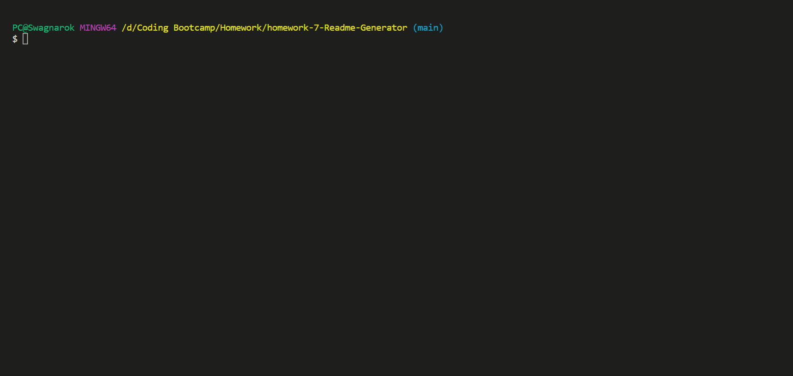

# README Generator

## Description

A Node JS application that will create a README.md file for us after entering some initial information.  
App can be found deployed [here](https://www.github.com/Swagnarok630/ReadMe_Generator).

## Table of Contents

* [Criteria](#criteria)
* [Installation](#installation)
* [Usage](#usage)
* [Contributing](#contributing)
* [Tests](#tests)
* [Questions](#questions)
* [Notes](#notes)
* [License](#license)

## Criteria

* We want a command-line application that accepts user input
* The application will give the user multiple prompts requesting information regarding their application repository
   * Title of project
   * Description of project
   * Installation instructions
   * Usage information
   * Contribution guidelines
   * Test instructions
   * Link to deployed app/Link to repository
   * Github username
   * E-mail
   * List of licenses
* A README.md file is created when the user finishes inputting all data
   * A title is properly created at the top of the README
   * A Table of Contents is created for the README
      * Items in the Table of Contents are links that take the user to corresponding sections of the README
   * A inputted data is correctly shown in their proper sections
   * License information properly referenced at bottom of README and badges properly shown near the top of README
   * A Questions section is created for the README
      * A link to the user's Github profile is made available
      * User's email is also linked as contact information

## Installation Instructions

We just perform an npm install and then run the application through node in the root directory.

## Usage

Once the application is loaded, the user will be prompted with questions that they will need to answer to proceed. Once all questions have been answered, the application will generate a README.md file.

Video showing full use of the application can be found [here](https://youtu.be/rJ5xlBE3xP8)

## Contributing

Anyone is welcome to contribute to this project as they see fit, as there can be many more improvements made. Look for my contacts in the upcoming Questions section.

## Tests

There are no particular test cases that need to be performed for this application.

## Questions

If there are any questions or concerns regarding the app, you may contact me through the following:
* Github - <https://github.com/Swagnarok630>
* E-mail - swagnarok.630@gmail.com

## Notes

Sample README file generated from app will be named generatedREADME.md as to avoid overwriting the current README file for the actual repository.

### Future Features
* Possibly add extra input for Table of Contents so additional sections can be added by user
* Possibly add step-by-step input fields for installation and testing sections
* Try to clean up license information

## License

Copyright (c) Darryl Le. All rights reserved.  
Licensed under [MIT](https://opensource.org/licenses/MIT) license(s).
